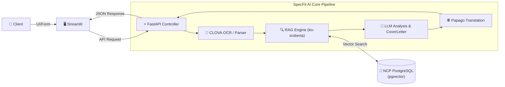

#  SpecFit-AI
> **NCP AI & Cloud DB 기반 Target 기업 합격자 맞춤형 스펙 갭 진단 및 AI 자기소개서·영문 이력서 생성 플랫폼**

---

##  1. 프로젝트 개요 (Overview)
**SpecFit-AI**는 취업 준비생이 목표 기업 및 직무를 설정하고 자신의 서류(이력서, 성적표, 자격증 등)를 업로드하면, **NAVER Cloud Platform(NCP)** 기반 AI 기술과 합격자 스펙 DB를 활용해 정량·정성적 역량을 멀티 차원으로 진단해주는 서비스입니다.

단순 스펙 비교에 그치지 않고, 직무 적합도(Fit Score) 산출, 부족한 역량을 메우기 위한 **30일 액션 로드맵**, **JD 맞춤형 자기소개서 초안**, 그리고 **Papago 전문 용어 매핑 기반 영문 이력서 변환**까지 통합 제공합니다.

---

## 2. 주요 기능 (Key Features)

| 기능 | 설명 |
| :--- | :--- |
| **📄 멀티 포맷 서류 직접 파싱** | NCP CLOVA OCR 및 Document Parser를 연동하여 `.png`, `.jpg`, `.pdf`, `.txt` 등 다양한 서류에서 성적, 자격증, 프로젝트 경험을 자동 추출합니다. |
| **📊 pgvector 기반 3자 RAG 스펙 진단** | NCP Cloud DB for PostgreSQL (`pgvector`)에 구축된 기업별 합격자 스펙 DB와 사용자의 스펙 간 고차원 임베딩 유사도 검색을 수행합니다. |
| **🎯 직무 적합도 & 정량/정성 갭 분석** | 합격자 평균 스펙 대비 사용자의 유무/우선순위를 비교하고, 인터랙티브 Plotly 게이지 차트 및 정성 분석 리포트를 생성합니다. |
| **✍️ JD 맞춤형 자기소개서 생성** | 지원 기업의 직무 요구사항(JD)과 사용자의 프로젝트 경험을 자연스럽게 연결한 합격 맞춤 자기소개서 초안을 작성합니다. |
| **🌐 Papago Resume Term 매핑 영문 이력서** | NCP Papago API와 채용 전문 용어 딕셔너리(Resume Glossary)를 결합하여 전문적인 영문 이력서/자소서로 즉시 변환합니다. |

---

## 🛠️ 3. 기술 스택 (Tech Stack)

### **Infrastructure & Cloud (NAVER Cloud Platform)**
* **Compute Engine:** NCP Compute Server (Ubuntu 24.04 LTS, 2vCPU, 4GB RAM)
* **Database:** NCP Cloud DB for PostgreSQL + `pgvector` extension (Vector Search)
* **Storage:** NCP Object Storage (스펙 서류 원본 및 정적 파일 저장소)
* **AI & API Integration:** NCP CLOVA OCR, NCP Papago Translation API

### **Backend & Core Engine**
* **Language:** Python 3.10+
* **Framework:** FastAPI, Uvicorn
* **Database & ORM:** SQLAlchemy, `psycopg2`
* **Parsing Tool:** `pypdf`, `Pillow`, `pytesseract`

### **Frontend & Visualizations**
* **Framework:** Streamlit (Enterprise SaaS Dashboard Theme)
* **Visualization:** Plotly (Interactive Gauge Charts)
* **Design/Layout:** Custom CSS (TanStack/React Dashboard Layout Porting)

### Backend Pipeline & Orchestration Architecture
- **파이프라인 오케스트레이션 (Pipeline Orchestration)**: FastAPI 백엔드(`main.py`)가 `CLOVA OCR ➔ pgvector RAG ➔ LLM Engine ➔ Papago API`로 이어지는 멀티 AI 파이프라인의 데이터 흐름과 호출 순서를 전담 제어합니다.
- **컨테이너 오케스트레이션 (Containerization)**: `Dockerfile` 및 `docker-compose.yml`을 통해 백엔드, 프론트엔드, DB 환경을 격리하고 단일 명령어 (`docker-compose up`)로 환경 종속성 없는 원클릭 배포를 일원화했습니다.
- **결함 허용 및 보안 설계 (Fault Tolerance & Security)**: DB 타임아웃 및 외부 API 장애 발생 시 서버 락업을 방지하는 예외 처리(Fallback) 로직을 적용하였으며, NCP ACG(Access Control Group) 기반 최소 권한 인바운드 규칙으로 인프라 보안을 강화했습니다.

---

## 4. 시스템 아키텍처 (System Architecture)



## 📂 5. 프로젝트 구조 (Directory Structure)

```text
SpecFit-AI/
├── app.py                   # Streamlit 메인 프론트엔드 대시보드
├── main.py                  # FastAPI 백엔드 API 엔드포인트 및 컨트롤러
├── papago.py                # NCP Papago 번역 및 용어 매핑 서비스
├── requirements.txt         # 필수 파이썬 라이브러리 목록
├── .env.example             # 환경 변수 설정 샘플
├── rag/
│   └── build_rag.py         # pgvector 데이터베이스 검색 및 RAG 파이프라인
└── services/
    ├── clova_ocr.py         # NCP CLOVA OCR 연동 및 문서 파서
    ├── llm_engine.py        # LLM 기반 스펙 갭 분석 및 자소서 생성 엔진
    └── papago.py            # 백엔드용 Papago 번역 모듈
```
## 🎬 6. 시연 및 테스트 사용 가이드 (Quick Start)

시연회나 개별 테스트 시 아래 순서대로 서비스를 손쉽게 체험해보실 수 있습니다.

### **1) 브라우저 접속**
* **시연 URL:** `http://<NCP_SERVER_IP>:8501` (또는 로컬 구동 시 `http://localhost:8501`)

### **2) 테스트 데이터 입력 가이드**
* **지원 기업명:** `네이버` 또는 `카카오` 입력
* **지원 직무:** `백엔드 개발자` 또는 `서비스 기획` 입력
* **내 문서 및 이미지 업로드:** 
  * 준비된 서류 파일(`.pdf`, `.txt`, `.png` 중 하나) 선택
  * *(테스트용 샘플 텍스트 파일이나 캡처된 이력서 이미지 파일 모두 지원됩니다.)*

### **3) 분석 결과 확인**
1. **[🚀 SpecFit AI 분석 및 자소서 추천]** 버튼을 클릭합니다.
2. 약 5~10초 후 생성되는 **종합 적합도 게이지 차트(Fit Score)**를 확인합니다.
3. **스펙 비교 테이블**에서 합격자 평균 대비 본인의 정량/정성적 갭과 **우선순위(상/중/하)**를 체크합니다.
4. 하단 **[자기소개서 & Papago 영문 이력서]** 탭을 전환하며, 국문 자기소개서 초안과 이력서 전문 용어로 정제된 **영문 자소서(English Cover Letter)**를 비교 검토합니다.

## 💻 7. 로컬 설치 및 실행 방법 (Installation)

### **1) Repository Clone**
```bash
git clone [https://github.com/min-jx-x/SpecFit-AI.git](https://github.com/min-jx-x/SpecFit-AI.git)
cd SpecFit-AI
```
### 2) 가상환경 생성 및 패키지 설치

```bash
# 가상환경 생성
python -m venv venv

# 가상환경 활성화 (Windows)
venv\Scripts\activate

# 가상환경 활성화 (Linux/macOS)
source venv/bin/activate

# 필요 패키지 설치
pip install -r requirements.txt
```
### 3) 환경 변수 설정 (.env)

프로젝트 루트 경로에 `.env` 파일을 생성하고 필요한 API Key 및 DB 정보를 설정합니다. (상세 내용은 `.env.example` 참조)

### 4) 서버 실행

```bash
# Terminal 1: FastAPI 백엔드 실행 (Port 8000)
uvicorn main:app --host 0.0.0.0 --port 8000 --reload

# Terminal 2: Streamlit 프론트엔드 실행 (Port 8501)
streamlit run app.py
```

## 👥 8. 팀원 및 역할 분담 (Team & Roles)

| 이름 | 담당 역할 | 주요 기여 내용 |
| :---: | :---: | :--- |
| **강민재** | **PM & Backend Lead** | - FastAPI 기반 AI 분석 파이프라인 수립 및 오케스트레이션 전담<br>- Docker/Compose 기반 컨테이너화 및 NCP 서버·ACG 방화벽 인프라 구축 |
| **유희찬** | **Frontend & UI/UX** | - Streamlit 대시보드 UI/UX 설계 및 Enterprise SaaS 다크 테마 커스텀 CSS 구축<br>- Plotly 게이지 차트 및 반응형 자소서/이력서 탭(Tab) 뷰어 구현 |
| **김대현** | **RAG & DB Engineer** | - NCP Cloud DB for PostgreSQL 구축 및 `pgvector` 벡터 검색 알고리즘 구현<br>- 합격자 스펙 데이터셋 전처리, 임베딩 파이프라인 및 RAG 검색 최적화 |
| **김성범** | **AI & OCR Engineer** | - NCP CLOVA OCR API 연동 및 이미지/PDF 서류 파싱 예외 처리 통합 로직 개발<br>- 서류 내 주요 키워드(어학, 자격증, 기술 스택) 추출 파서 설계 |
| **박창연** | **LLM Prompt & Translation** | - 스펙 갭 진단, 직무 적합도(Fit Score), 자기소개서 생성 프롬프트 엔지니어링<br>- NCP Papago API 연동 및 이력서 도메인 특화 용어 사전 매핑 개발 |

---

## 🔧 9. 트러블슈팅 (Troubleshooting)

### 1. NCP Cloud DB (PostgreSQL) 타임아웃 및 RAG 파이프라인 지연
* **문제 상황:** 프론트엔드에서 분석 요청 시 180초 타임아웃(`Read timed out`) 오류가 발생하며 예시 데이터가 출력되는 현상 발생.
* **원인 분석:** NCP Compute Server에서 Cloud DB for PostgreSQL(`pgvector`)로 접속을 시도할 때, DB 인스턴스의 ACG(방화벽) 규칙에 인바운드 허용(5432 포트)이 누락되어 DB 커넥션 타임아웃이 발생하고 RAG 벡터 검색이 무한 대기 상태에 빠짐.
* **해결 방법:** 
  1. NCP Console의 Cloud DB ACG 설정에서 Compute Server IP에 대한 `TCP:5432` 포트 인바운드 허용 규칙 추가.
  2. `rag/build_rag.py` 내 DB 커넥션 타임아웃 옵션을 단축 설정하고, 실패 시 예외 처리(Fallback) 로직을 적용하여 서버 전체 락업 방지.

---

### 2. LLM + Papago 번역 연쇄 호출 시 백엔드 응답 시간 지연
* **문제 상황:** OCR 파싱, RAG 벡터 검색, LLM 스펙 분석 및 자기소개서 생성, Papago 영문 번역이 단일 API 요청(`/api/analyze`) 내에서 동기식(Synchronous)으로 연속 처리되어 전체 처리 시간이 급증함.
* **원인 분석:** Papago API 연동 및 LLM 프롬프트 처리 과정이 결합되면서 네트워크 RTT(Round Trip Time)가 중첩되어 프론트엔드 HTTP 클라이언트 타임아웃 임계값을 초과함.
* **해결 방법:**
  1. FastAPI 백엔드의 비동기 처리 구조를 점검하고 프론트엔드(`app.py`)의 HTTP 요청 타임아웃 옵션을 300초로 상향 조정.
  2. Papago 번역 서비스 모듈화 및 이력서 도메인 특화 용어 사전(Resume Glossary) 매핑 필터를 경량화하여 API 오버헤드 최소화.

---

### 3. 멀티 포맷 서류(PDF/TXT) 파싱 시 데이터 구조 불일치 (KeyError)
* **문제 상황:** 사용자가 업로드한 파일 확장자(`.pdf`, `.txt`, `.png`) 및 내용 구조에 따라 OCR/Text Parser가 반환하는 JSON 데이터 키(Key) 구조가 가변적으로 달라져 백엔드 파이프라인에서 `KeyError` 발생.
* **원인 분석:** 파서별 추출 필드(어학, 자격증, 학점 등) 유무에 따라 딕셔너리 구조가 유연하게 변경되는데, 후속 LLM 엔진 입력을 형성하는 과정에서 고정 키 접근 방식을 사용함.
* **해결 방법:**
  1. 파싱 결과 객체에 `.get()` 기반의 Defensive Programming(방어적 프로그래밍) 적용하여 널 값(Null-safe) 보장.
  2. 파싱 로직 하단에 스키마 정규화 단계(Schema Normalization)를 추가하여 항상 일정한 딕셔너리 포맷을 백엔드로 넘겨주도록 구조 개편.
 
---
### 4. PDF나 TXT 파일 업로드 시 `KeyError`가 발생하며 결과 화면이 나오지 않는 현상
  * **원인:** 백엔드에서 파싱되어 리턴되는 딕셔너리 Key 구조와 프론트엔드(`app.py`)에서 렌더링 시 참조하는 Key 명칭 간 불일치 발생.
  * **해결:** `app.py`에서 `.get()` 메서드 기반 방어 로직을 작성하여 널 값(Null-safe) 및 키 미존재 예외 처리를 수행했습니다.
